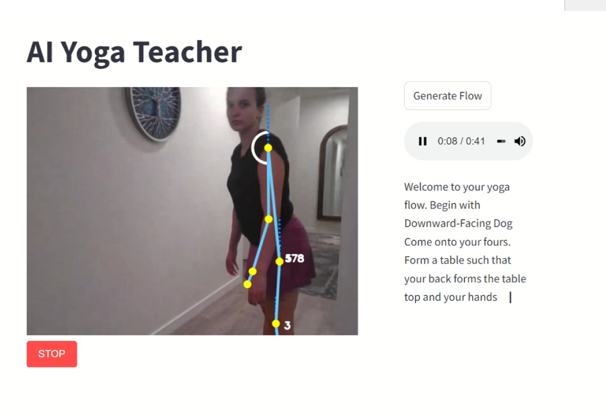

# Building a AI Yoga Teacher  using MediaPipe

### Install required packages

```
pip install -r requirements.txt
```

### Execution

```
python -m streamlit run Demo.py
```


Wouldn't you want to know if you have good posture while doing yoga or exercising? Do you want to know if you are doing yoga poses correctly and efficiently?

As someone who started my yoga practice at home, I wasn't always sure if I was doing the poses "right". Am I not pushing myself enough or maybe I am over-extending? 

The goal of this project is to create a tool that given a video feed will be able to categorize if a human body is doing poses efficiently enough, with good posture or not. 

Here is some preliminary research on the topic: 

[Detecting Bad Posture With Machine Learning](https://towardsai.net/p/machine-learning/detecting-bad-posture-with-machine-learning#:~:text=Using%20state-of-the-art%20machine%20learning%20and%20computer%20vision%2C%20it,can%20significantly%20decrease%20the%20risk%20of%20musculoskeletal%20disorders.) 

[Building a Poor Body Posture Detection & Alert System Using MediaPipe Body Tracking
Building a Poor Body Posture Detection & Alert System Using MediaPipe Body Tracking](https://learnopencv.com/building-a-body-posture-analysis-system-using-mediapipe/)

[Yoga dataset: A resource for computer vision-based analysis of Yoga asanas](https://www.ncbi.nlm.nih.gov/pmc/articles/PMC10293982/)

[Novel deep learning models for yoga pose estimator](https://link.springer.com/article/10.1007/s42452-023-05581-8)

[A Survey on Artificial Intelligence in Posture Recognition](https://www.ncbi.nlm.nih.gov/pmc/articles/PMC7614502/)

https://github.com/LunaticPrakash/yoga-api/blob/master/yoga-api.json
https://www.kaggle.com/code/s1155077325/yoga-asana-recommender-system